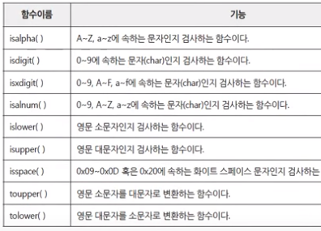
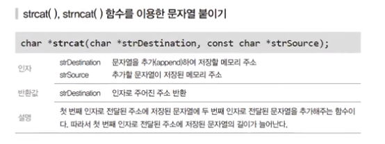
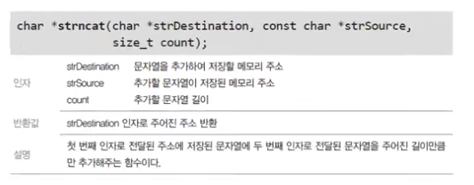
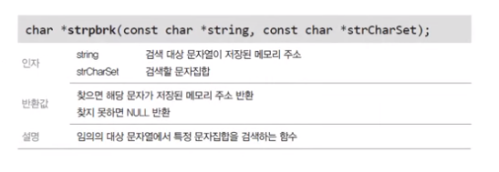

# 12. Advanced Topics of Function

## 매개변수 전달 방법
- A 함수 내부에서 B 함수를 호출하는 코드가 있다면, A는 호출자(Caller)이고 B는 피호출자(Callee)다.
- 두 함수가 호출/피호출 관계로 묶이는 것을 **바인딩(Binding)** 이라고 한다. (→ Runtime 결정)
- 두 함수가 서로 연결되는 인터페이스는 **매개변수와 반환자료** (호출자 함수는 **매개변수의 초기값을 규정**할 문법상 의무가 존재)

함수호출 과정에서 매개변수로 전달되는 정보에 따라, 매개변수의 전달방법이 달라진다.

### **(1) Call by Value**
> 피호출함수는 **값 자체를 매개변수로 받아** 연산을 수행, 적절한 정보를 반환한다.

<br>

### **(2) Call by Reference**
> 매개변수가 포인터인 경우 호출자는 반드시 메모리의 주소를 인수로 넘겨야한다.

- 즉, 피호출자 함수는 전달된 **메모리 주소(매개변수)를 간접지정** 함으로써 포인터가 가리키는 대상에 접근할 수 있다. <u>이를 통해 배열과 같은 덩치가 큰 메모리를 매개변수로 전달할 수 있고, 유지 보수에 장점이 있다.</u>
- 이렇듯, 매개변수가 포인터일 때 포인터가 가리키는 대상 **메모리의 크기를 인수로 전달하는 것**이 보안과 설계의 측면에서 굉장히 중요하다.

    ```cpp
    void GetName(char *pszName, int nSize){
    	printf("이름을 입력하세요 : ");
    	gets_s(pszName, nSize);
    	return 0;
    }
    ```

**잘못된 주소 전달**
1. parameter로 전달할 때 주소를 구체적으로 기술하여 매개변수로 전달하는 것은 호출자 함수의 책임이다!
2. 피호출자 함수가 포인터 주소를 반환하는 경우, 피호출자 함수가 반환한 주소가 가리키는 대상 메모리는 반드시 유효해야 한다.
    - ex) 이미 OS에 반환(free)한 메모리를 반환하거나, 함수 내 지역변수의 메모리 주소를 반환해서는 안된다.

<br>

## 재귀호출
> 반복문 + STACK = 함수가 내부에서 다시 자기 자신을 호출하는 경우
- 반복문은 계수 기반의 구조라면,
- 재귀호출에서는 **조건에 부합할 때 함수를 반환시키는 방법으로 반복을 중지**한다.

```cpp
int GetFactorial(int param){
	int nResult = 0;
	if(param == 1) return 1;
	nResult = param * GetFactorial(param - 1);
	return nResult;
}

int main(void){
	printf("%d\n",GetFactorial(5));
	return 0;
}
```

**재귀호출을 사용하는 경우는?**
- Tree와 같은 **비선형 자료구조**를 다룰 때 경로를 기억하기 쉬우므로 재귀호출을 자주 사용한다.

**재귀호출은 For문 + Stack구조보다 느리다! 왜?**
- 함수 호출 시 발생하는 **Overhead**(call stack 증가, 매개변수 복사, call stack 다시 원위치)가 계속 반복
- 이러한 것을 방지하기 위해서 **매크로** & **inline 함수** 등장

<br>

## 문자(열) 처리 함수

- **문자 처리 함수**

    

**문자열 처리 함수**
- **`char * strcat(char *strDestination, const char *strSource)`**

    

- **`char * strncat(char *strDestination, const char *strSource, size_t count)`**

    

- **`char * strcat_s(char *strDestination, size_t size, const char *strSource)`** → strcat 대신 사용 및 순서 주의
    - 파일의 경로를 나타내는 문자열을 조합할 때 많이 사용된다.

        ```cpp
        void ehstrcat_s(char *dest,size_t size, const char *source)
        {
            int len = strlen(dest);                  // dest 문자열 길이 계산
            assert(size > (len + strlen(source)));   // size는 dest 문자열 길이 + source 문자열 길이보다 커야 함
            strcpy_s(dest+len, size-len, source);    // dest + len 위치(buffer_size = size - len)에 source 문자열 복사    
        }
        ```

- **`char * strpbrk(const char *string, const char *strCharset)`**
    - `strstr()`과 달리, 대상 문자열에서 특정 ‘문자열'이 아닌, ‘문자들' 중 하나라도 있는지 검색

    

<br>

## 유니코드 문자열

C언어에서 문자열은 **MBCS(Multi-bytes Character Sets)**, **유니코드(UNICODE)** 로 구별할 수 있다.

그 동안 다룬 문자열은 모두 MBCS 문자열이며, MBCS에서는 영문 한 글자는 1byte, 한글 한 글자는 2byte를 사용한다. 이와 같이 영문, 한글, 한자 표현의 차이는 프로그램의 문자열 길이 계산에도 영향을 준다.

- 예를 들어, `String`이라는 문자열의 길이는 6이고 실제로 문자의 개수도 6개이고, 이 문자열을 저장하려면 char[7]개가 필요하다.
- 하지만 `문자열`이라는 한글 문자열은 길이가 6인데 반해 실제 문자의 개수는 3개이다.
- **즉, 문자열의 길이와, 문자 개수가 서로 다르다는 문제가 발생한다.**

유니코드는 이러한 문제들을 극복하기 위해서 등장
- 문자 하나를 표현하기 위해서 **16bit 또는 32bit 자료형을 사용**한다.
- 환경마다 다르지만, 윈도우 운영체제는 16bit 자료형을 사용하고, 따라서 유니코드 형식인 **wchar_t 형은 2byte를 차지**한다.

유니코드 문자, 문자열을 상수 형식으로 표기 →**문자열 앞에 ‘L’을 붙여서 `L"String"` 형식으로 표기**

- `L"String"`의 자료형은 `wchar_t[7]`이며, 바이트 단위 크기는 14(2byte * 7)이다.
- `L"문자열"`의 자료형은 `wchar_t[4]`이며, 바이트 단위 크기는 8(2byte * 4)이다.

즉, UNICODE에서는 영문, 한글, 한자에 상관없이 메모리의 크기가 **(문자열의 길이 + 1) * sizeof(whcar_t)**로 통일된다.

**전처리기를 통해 언제 MBCS or UNICODE를 쓸지 설정한다.**

```cpp
#ifdef _UNICODE
#define TCHAR wchar_t
#else
#define TCHAR char
#endif
```

<br>

## 유니코드 전용 함수

유니코드 문자열을 MBCS 문자열 처리함수로 출력하면 첫 글자만 출력되는 현상이 발생한다. 따라서, **유니코드 전용 문자열 함수를 사용해야 한다.**

- **`wprintf()`, `wcscpy()`, `_putws()`**
    - 유니코드 문자열은 **유니코드 문자열 전용 함수**를 사용해야 한다.
    - wcscpy() 함수에도 보안 결함이 존재하므로, 대체함수로써 `wscpy_s()`, `wcsncpy()`