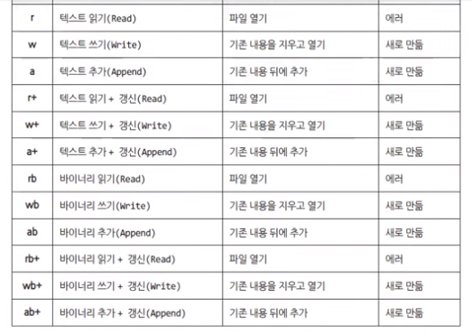

# 14. File Input / Output


## FILE
 1) User mode에서 Kernel mode로 진입할 수 있는 Interface
 2) 파일 단위의 정보를 생성, 삭제, 저장, 검색 할 수 있도록 정보를 구성하는 방법
 3) 장치를 추상화 한 것

- 데이터 파일, 실행 파일과 같이 우리가 보편적으로 생각하는 파일
- 기본적으로 파일마다 고유의 Input, Output Buffer 가 있다.
- 데이터 파일, 실행 파일과 같은 것들을 관리하는 체계를 File System이라고 부른다. → FAT32(USB), NTFS(Windows)

**FAT**
- **HDD** = Hard Disk Drive = 자기원판으로 구현
- **Track**과 **Sector**를 통해서 정보의 단위를 표현 가능
    - 일렬로 나열 하면 하나의 완벽한 **선형구조로 표현 가능**하다
- Sector 하나가 대략 512byte를 차지
- 예를 들어 HDD에 파일 하나가 2번 Track, 4번 Sector 에서 시작한다고 하자. 연속적으로 정보를 저장하다가 중간에 파일이 있으면 건너뛰고 또 저장하는 방식으로 파일 저장
- **어떤 파일이 어떤 TRACK, 어떤 SECTOR에서 시작된다는(시작점) TABLE**을 FAT라고 부른다 = File Allocation Table 만약 32bit로 표현 시 FAT32, 16bit로 표현 시 FAT16

**NTFS**
- OS를 설치할 때 FILE SYSTEM을 무엇으로 할 것인지 결정
- NTFS같은 경우 Volume Label을 나누고(C 드라이브, D 드라이브) Format 과정을 거친다 (Sector와 Track을 나누는 것)
- 원래는 아무것도 없는 텅빈 공간 = 관리가 불가능
- formatting을 통해서 관리가 가능해지는 것!

<br>

## FILE의 특징

**(1) File의 논리구조는 선형구조**
- File Streaming은 Buffer & Queue와 연관

**(2) File은 DISK(보조기억장치)를 사용하는 방법 중 하나**
- 보조기억장치에 저장되어 관리되는 정보의 단위
- `DISK` : 공간의 크기는 대용량, 속도는 저속
- `RAM` : 공간 크기가 작고, 속도는 매우 고속

**(3) File에는 입출력 지점이 정해져있다.**
1. 특정 지점을 개방 [생성] 한다.
2. 크기가 0인 공간에 Write하면(100byte) Disk 전체 공간에서 100byte를 감소시켜서 처음 입출력 포인트에서 100byte가 Write된다.
3. 그에 따라 I/O 지점이 100byte 만큼 뒤로 이동한다.
4. 또 다시 Write를 하게 되면 이동한 I/O 지점에 이어서 과정을 거치게 되고, 파일의 크기는 자동으로 크기가 증가한다.

**(4) 텍스트 파일 vs 바이너리 파일**
- 1을 EOF로 인식하느냐 아니면 binary data 그 자체로 인식하느냐의 차이를 가짐

<br>

## fopen(), fclose()
특정 경로에 있는 파일을 열어서 접근할 수 있도록 FILE 구조체에 대한 주소를 반환하는 함수. 파일을 개방(혹은 생성)하는데 성공했다면 NULL이 아닌 값을 반환하는데, 나중에 사용이 끝나면 fclose( )함수로 닫아줘야 한다. 

→ Window 환경에서는 보안을 위해 fopen_s( ) 함수 제공

- **`FILE * fopen(const char *filename, const char *mode)`**
    - `filename`**:** 열고자 하는 대상 파일의 절대 경로 문자열
    - `mode`**:** 접근 모드를 명시한 문자열

        

    - **반환값** = **FILE 구조체**에 대한 주소 반환, 만일 에러가 발생하면 NULL 반환
    - 반환된 FILE 구조체는 `fclose()` 함수를 이용하여 반드시 닫아야 한다.

- **`int fclose(FILE *stream)`**
    - `stream`: 닫을 파일에 대한 FILE 구조체의 주소
    - **반환값** = 함수가 성공하면 0을 반환하고 만일 에러가 발생하면 EOF 반환
    - 이 함수는 파일의 입출력을 끝내고 파일을 닫는다

- **`int _fcloseall(void)`**
    - **반환값** = 닫은 파일의 개수
    - 프로그램에서 열어둔 모든 파일을 닫는다.

```cpp
#include <stdio.h>
void main( ){
	FILE * const fp = fopen(“Test.txt”, “w”);  
	// 파일 제어에 필요한 FILE 구조체에 대한 포인터 변수 선언 및 정의
	// 이미 존재하면 삭제하고 새 파일 생성, 없다면 새로 생성

	if (fp == NULL){
		puts(“ERROR : FAILED TO OPEN FILE!”);
		return;	
	}
	fclose(fp);
	return;
}
```

<br>

## 파일 접근 제어

만일 어떤 프로그램(혹은 시스템)이 이미 파일을 열어 두었다면, 접근이 제한될 수 있습니다. 이는 파일에 저장된 정보가 여러 프로그램에 의해 동시에 편집되어 엉키는 일이 발생하지 않도록 하기 위함입니다. 그러므로 파일을 다룰 때는 반드시 접근 제어 문제에 대해서 생각해야 하며, 다음과 같은 사항들에 주의해야 합니다.

- 파일에 접근하려면 우선 파일을 개방해야 하며, 파일에 대한 입출력을 완료한 후에는 파일을 닫아야 한다.
- 파일을 개방할 때는 반드시 목적(입출력 혹은 수정)을 명시해야 한다.
- 파일이 이미 사용 중인 경우(파일이 개방된 상태), 접근이 제한될 수 있다. 그러나 경우에 따라 읽기는 허용될 수 있다.
- 만일 파일의 속성이 ‘읽기 전용'이면 쓰기모드 개방이 제한된다.
- 경우에 따라(특히, 보안상 권한 문제 때문에) 읽기조차 제한될 수 있다.

<br>

## 텍스트 파일 입출력

> 파일 입출력은 표준 입출력처럼 전용 함수를 이용합니다.

사실 정확히 따지면 `printf()`나 `scanf()`같은 표준 입출력 함수도 내부적으로는 파일 입출력 함수입니다. 다만 콘솔의 입력 장치를 추상화한 파일에 대해서만 입출력을 수행하기 때문에 별도로 분리한 것뿐입니다. 좀 더 정확히는 stdout 포인터가 가리키는 파일에 출력하는 함수가 printf()이고, stdin이 가리키는 파일에서 정보를 읽어오는 함수가 scanf()입니다. putchar(), getchar(), puts(), gets() 함수도 마찬가지 입니다.

- **`int fprintf(FILE *stream, const char *format [, argument]...)`**
    - `stream`: FILE 구조체에 대한 포인터

        `format`: 형식 문자열이 저장된 메모리 주소

        `[, argument ]`: 형식 문자열에 대응하는 가변 인자들

    - **반환값** = 출력된 바이트 수
    - 형식 문자열에 맞추어 대상 파일에 문자열을 출력하는 함수

    ```cpp
    #include <stdio.h>
    #include <stdlib.h>
    void main(void){
    	FILE *fp = NULL;
    	fp = fopen(“Test.txt”, “w”);
    	fprintf(fp, “%s\n”, “Test String”);
    	fclose(fp);
    	system(“notepad.exe test.txt”);
    	return;
    }
    ```

- **`int fscanf(FILE *stream, const char *format [, argument ]...)`**
    - `stream`: FILE 구조체에 대한 포인터

        `format`: 형식 문자열이 저장된 메모리의 주소

        `[, argument ]`: 형식 문자열에 대응하는 가변 인자들

    - **반환값** = 성공적으로 읽어 들인 항목(field)의 개수
    - 형식 문자열에 맞추어 대상 파일로부터 정보를 읽어들이는 함수이다.

- **`int fgetc(char *stream)`**
    - `stream`: FILE 구조체에 대한 포인터
    - **반환값** = 정상적인 경우 파일에서 읽은 문자 반환, 에러가 발생하면 EOF 반환
    - 대상 파일에서 문자를 읽어 들이는 함수이다
- **`int fputc(int c, FILE *stream)`**
    - `c`: 파일에 쓸 문자

        `stream`: FILE 구조체에 대한 포인터

    - **반환값** = 정상적인 경우, 파일에 쓴 문자 반환. 에러가 발생하면 EOF 반환
    - 대상 파일에 문자를 쓰는 함수이다.
- **`char fgets(char *buffer, int size, FILE *stream)`**
    - `buffer`: 읽어 들인 문자열이 저장될 버퍼의 주소

        `size`:입력 버퍼의 바이트 단위 크기

        `stream`: FILE 구조체에 대한 포인터

    - **반환값** = 정상적인 경우 buffer 인자로 전달된 주소 반환, 에러가 발생하면 NULL 반환
    - 대상 파일에서 한 행의 문자열을 읽어 들이는 함수이다.
- **`int fputs(const char *string, FILE *stream)`**
    - `string`: 출력할 문자열이 저장될 기억공간의 주소

        `stream`: FILE 구조체에 대한 포인터

    - **반환값** = 정상적인 경우, 음수가 아닌 값을 반환. 에러가 발생한 경우에는 EOF 반환
    - 대상 파일에 문자열을 출력하는 함수
- **`int fflush(FILE *stream)`**
    - `stream`: FILE 구조체에 대한 포인터
    - **반환값** = 성공하면 0 반환, 실패하면 EOF 반환
    - 파일에 대한 입출력을 완료한 후, 파일 입출력과 관련된 정보들을 초기화한다. 
    단, 메모리를 초기화하지는 않는다. 그리고 출력 스트림을 Flushing 하는 기능만 제공한다고 봐야 한다.

**바이너리 파일 입출력**

바이너리 파일(binary file)은 텍스트 파일을 제외한 모든 파일입니다. 만일 여러분이 MP3 파일을 fopen() 함수로 열고자 한다면 반드시 바이너리 모드로 개방해서 처리해야 합니다. 파일을 바이너리 모드로 개방할 때는 **접근 모드 문자열에 반드시 b를 포함**해야 합니다.

**`fread()`와 `fwrite()` 함수**는 fgets( )와 fputs( )와 달리 입출력의 길이가 일정한 메모리 덩어리입니다. 문자열의 경우 전체 문자열의 길이가 달라질 수 있습니다. 따라서 입출력 할 때 사용되는 메모리와 실제로 파일에 입출력되는 정보의 크기가 매번 달라질 수 있습니다.

**그러나 바이너리 모드로 파일 입출력을 시도할 때는 정해진 길이 만큼 읽고 써야합니다. 그리고 그 메모리 덩어리에 어떤 정보가 저장되어 있는 상관없이 저장할 수 있습니다.**