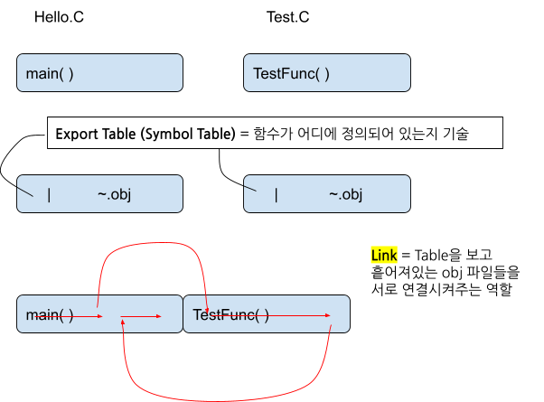

# 15. Optimization & Type qualifier

## 최적화

> 중요 키워드 = **컴파일러**가 **코드**를 **최적화(Optimization)**

**Project Build 할 때 2가지 모드**

- **Debug**(default mode): 코드를 있는 그대로 모두 해석하며 코드를 분석할 때 중요하다.
- **Release**: 프로그램 개발이 끝난 후 Debug 모드가 필요없을 때 최적화를 시킨다. → Release모드로 전환하면 오류가 발생하고 죽는 경우가 있는데 최적화 문제 때문이다.

**최적화 논의 과정**
컴파일러 최적화를 위해 필요한 논의 과정은 **변수 사이의 의존성** 문제를 고려하는 것
- 특정 연산은 특정 변수에 대해 의존성이 존재하므로 순차적으로 진행되어야 한다.
- 그렇다면, 서로 관련이 없고 의존성이 없는 것은 동시에 해도 되지 않을까? → **동시성** 존재!
    - 즉, **특정 변수(자료)에 대해 의존성이 존재하는 연산들을 구별해낼 수 있어야 한다.**

따라서, 최적화란 코드에서 군살을 제거하겠다는 의미!
- **효율이 나쁘다고 확인되거나 논리적으로 매우 당연한 코드들을 군살로 취급**
- 컴파일러가 **컴파일 할 때, 해당 코드를 없애버린다.**

```cpp
// Debug Mode
int nResult = 0;
for(int i=0; i<10; i++)
	nResult = 10;
printf(“%d”, nResult);

// Release Mode
nResult = 10;
printf(“%d”, 10);
```

<br>

## 최적화 고려 요소

**(1) 변수가 적은 것이 좋다.**
- 메모리가 적게 들기도 하지만
- 변수가 많아지면 서로 연산으로 묶이고, 조합에 따른 경우의 수가 기하급수적으로 늘어나므로 논리적인 구조가 복잡해질 수 밖에 없다.
- 따라서, 변수가 많으면 컴파일러가 코드의 논리구조를 파악하기 어려워서 최적화를 하기 어려워진다.

**(2) 컴파일러가 최적화하기 좋게 작성하는 것이 중요하다.**
- 최적화라는 행위 자체는 대단히 **기계적 & Low-level**에서 다룬다.
- high level code 보다는 컴파일러가 최적화하기 좋은 조건을 만드는게 중요

**(3) 최적화를 방해하는 요소**
1. 변수가 많은 경우
2. 포인터 사용 자제
    - <u>포인터가 가리키는 대상의 위치는 Runtime에 결정</u>되므로 컴파일러의 범위가 아니다.
    - C++에서는 pointer 대신 참조가 등장

**최적화 정리**
1. **Compiler**가 컴파일 과정에서 진행한다.
2. 자료(변수)를 중심으로 연산과의 **의존성**을 기준으로 진행한다.
3. 핵심: 필요없는 High-level code를 컴파일 과정에서 제거해서 **성능 개선**

<br>

## 형 한정어 - const
> 형 한정어 `const`는 변수를 '상수화'하는 역할을 한다. 즉 변수를 변하지 않는 자료로 만든다.
- 변수의 본질은 메모리이므로, **특정 메모리를 “읽기 전용”으로 만들어주는** 형한정어
- 유지보수의 측면에서 중요(실수 방지)
- **변수가 줄어드는 효과**가 나타난다. → **최적화와 성능향상에도 도움**

**const를 적절히, 자주 사용하는게 중요하다.**
> 프로그램을 기획할 때 70점 이상을 합격으로 판정하는 프로그램을 만들 것이다. 그런데 프로그램 코드에 Hard Coding을 통해 70이라고 기술해놓으면 나중에 기준을 변경할 시에 모든 숫자를 바꿔버려야 하는 문제가 생긴다. 또한 실수로 변하지 않아야하는 기준의 값을 바꿔버리는 실수를 저지를 수도 있다. 따라서, 이럴 때는 하드코딩 하지 말고, 변수를 상수를 만들어서 심볼릭 상수(Symbolic Constant)로 만든다.

**상수형 pointer**

사실 C언어로 장치를 제어할 목적이 아니라면 C언어는 오히려 비효율적인 개발방법이 될 수도 있는데, 그 원인 중 하나가 바로 **‘포인터’**

물론 한 함수 내부에서 상수형 포인터 변수를 지역변수로 선언해서 사용할 일은 거의 없다. 하지만 코드가 2개의 함수로 분할된 상황에서, 피호출자 함수가 주소를 매개변수로 받는 ***Call by Reference*인 경우 피호출자 함수의 연산으로 인해 호출자의 메모리가 변경될 가능성이 없도록 문법적으로 강제화하는 노력이 필요하다.**

1. `const int *pnData = &nData;`
    - pnData pointer가 가리키는 것이 `const int` 이다
    - 즉, 새로운 주소로 간접지정은 가능한데 **간접지정을 통해 내용을 바꾸는 것은 불가능**하다.
2. `int * const pnData = &nData;`
    - pnData는 **상수화된 포인터 변수**로 포인터 변수에 저장된 주소 상수를 바꿀 수 없다.
    - C++의 **`int pnData = &nData;`**

**Example**
```cpp
void GetName(char *pszName, int nSize){     // 받아온 pointer에 Write
	printf("Input your name: ");
	char szBuffer[32];
	gets_s(szBuffer, sizeof(szBuffer));
	strcpy_s(psz, nSize, szBuffer);
	return;
}

void PrintName(const char *pszName){        // 받아온 주소를 Read만 할 것이므로, const char pointer로 받아온다 = 안정성을 높임
	printf("Your name is %s\n", pszName);
	//*pszName = ‘A’;
	//strcpy_s(pszName, 2, “A”);            -> warning으로 경고를 내보낸다.
	return;
}

int main(void){
	char szName[32] = {0};
	GetName(szName, sizeof(szName));
	PrintName(szName);
	return 0;
}
```

<br>

## 형 한정어 - volatile
> compiler는 결국 기계(프로그램)이므로, 정해진 대로만 움직이지만 예외를 줘서 해당 **코드를 최적화(생략)하지 못하게 하는 형 한정어!**

- 비효율적이지만, 꼭 해야하는 연산의 경우 예외 처리
- **Embedded System/Operating System** 을 개발해야 한다면 중요하다.
- 변수 앞에 volatile로 묶어주면, 이 변수에 의존성이 존재하는 모든 연산을 정상적으로 최적화(생략)하지 않고 compile한다.

```cpp
int main(void){
		int nResult = 0;
		for(int i =0; i<10; i++)
			nResult = 10;
		printf("%d\n", nResult);
		return 0;
}

// Optimization
int main(void){
		printf("%d\n", 10);
		return 0;
}
```

Optimization하지 않은 위와 같은 비효율적인 코드가 필요한 경우가 있다.
- 예를 들어, 외부기기(센서)가 CPU안에 있는 RAM을 주기적으로 & 반복적으로 10의 값을 대입해줘야하는 경우가 있다면,
    - compiler가 해당 코드를 최적화하는 것을 피하기 위해 volatile을 사용
    - `volatile int nResult = 0;`

<br>

## 형 한정어 - extern

함수를 작성할 때 원형선언(`.h`)과 정의(`.c`)를 분리할 수 있는 것 처럼, 변수도 **외부변수 선언과 정의**로 구분할 수 있다.

→ 함수처럼 외부변수 선언만 있고 정의가 누락되면 컴파일 오류가 아닌 **링크 오류**가 발생한다.

**C언어의 선언과 정의**

**선언**

- 일종의 공약, concept같은 개념이며 추상적인 것
- **Compile Time**에 중요하다

**정의**

- 일종의 이행, concept을 구현하는 것
- **Link Time**에 중요하다

**코드가 많아지면 코드를 분할해서 관리할 필요가 있다.**



코드를 분할하여, 여러개의 .c 파일로 나눈다.
- **분할 Compile**이라고 한다. = 나누어서 작성하고 build하는 것
- Main가있는 `Hello.c`와 여러 함수를 가진 `Test.c` 파일

`.c` 파일에는 정의를 넣는 것이 원칙
- 따라서 Hello.c와 Test.c를 compile하면 obj파일이 된다.
- 그래서 이 2가지를 합쳐서 최종적으로 Hello.exe라는 실행파일을 만들고, 이 과정을 Link라고 한다.
- **원형 선언을 해서** Linker가 외부에서 정의를 찾도록 한다.
- 만약 `World.c`를 만들어서 이 안에 같은 이름을 가진 함수(`TestFunc()`)를 만들게 되면, 정의가 2군데 있어서 조립(Link) 실패 오류!

이미 정의되어 있는 변수를 쓰고 싶다면, **외부변수(extern) 선언**
- 변수의 정의가 현재 파일이 아니라 다른 파일(외부 파일)에 존재한다는 것을 Linker에게 알려준다.

**`extern int g_nData;`**
- 절대로 정의를 명시해서는 안된다. (정의가 파일 밖에 있기 때문에)
- 선언과 정의가 서로 다른 파일로 분리되었다는 점이 중요
- 그리고 이는 **Link Time**에서 중요하다 라는 것을 기억해두자
    - compile Time에서는 다른 obj 파일에 정의가 존재한다고 가정하고 넘어가기 때문에 에러없이 obj 파일을 만든다.

<br>

## 형 재선언
> 형 재선언 = 자료형 재정의

- **형식 재선언이 과연 필요한 것인가?**
    - 생산성을 위해서 만들었는데, 결과적으로 혼란을 야기해버렸다.
    - 제한적으로 필요한 경우가 존재한다.
        - 주의해서 사용하시오! 가급적이면 사용을 자제
    - 구조체, 열거형 상수와 연계를 해서 하기는 한다. 그런데 기본 형식을 재선언 하는 것은 주의하자 = 자제하자!

    `UINT nData;`

    - unsigned int 를 줄이기위해서 **UNIT**로 썼는데, 이를 처음 보는 사람들은 이게 무엇인지 확인할 수 밖에 없다. → ***가독성이 떨어진다***
    - **헝가리안 표기법** = 코딩 컨벤션(규칙)
        - "변수이름에서 용도가 드러나게 하라."
        - int nData까지만 해야하는데, LParam nData까지 자료형식까지 해당 표기법을 적용해서, 자료형식에 그 용도가 드러나게 해버렸다.

**typedef 예약어**를 이용해 새로운 자료형을 선언하는 문법입니다.

- 그리고 typedef 예약어로 선언된 새 자료형을 **사용자 정의 형식**이라고 합니다.

**`typedef 원형식 새형식;`**
- 전처리기로, `#define UINT unsigned int` 로 구현은 가능한데 의미는 다르다
- `#define`은 단순 치환 기능이고, `typedef`는 새 형식을 자료형으로 인정한다

<br>

## 열거형 상수

열거형 상수는 `#define` 전처리기처럼 심볼릭 상수를 정의하는 것과 같다.
- 차이가 있다면, 여러 개의 심볼릭 상수를 한꺼번에 정의하고 구조체처럼 새로운 사용자 정의 자료형으로 활용하는 것도 가능하다.
- 특히 Switch-case 구문을 이용할 때나 적절하게 활용하면 코드의 가독성을 훨씬 높여주는 순기능을 가진다.
- `enum 형식명 {값이름[=정수], 값이름[=정수], …};`

```cpp
enum ACTION {MOVE, JUMP, ATTACK};
// MOVE, JUMP, ATTACK 은 각각 0,1,2 가 된다.

typedef enum COLOR { 
	RED	  = 100,
	GREEN = 200,
	BLUE  = 300
} COLOR;
// Red만 정의 해주면 GREEN, BLUE 는 각각 101,102가 된다

int main(void){
	enum ACTION act = MOVE;
	COLOR color = GREEN;
	
	printf(“%d %d\n”, act, color);
	return 0;
}
```